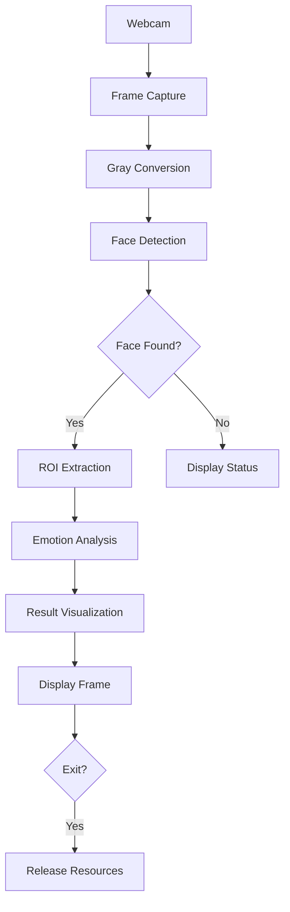

# Real-time Emotion Detection System 👁️😊

  
  
  
  

## 📑 Table of Contents
- [✨ Features](#-features)
- [📋 Prerequisites](#-prerequisites)
- [🛠️ Installation](#-installation)
- [📖 Usage](#-usage)
- [🧠 Technical Architecture](#-technical-architecture)
- [🐛 Troubleshooting](#-troubleshooting)
- [👨‍💻 Development Setup](#-development-setup)
- [🧪 Testing](#-testing)
- [🤝 Contributing](#-contributing)
- [📄 License](#-license)
- [🙏 Acknowledgments](#-acknowledgments)
- [❓ FAQ](#-faq)

## ✨ Features
- 🎥 Real-time face detection using Haar Cascades
- 🤖 Emotion recognition for 7 basic emotions:
  - 😠 Angry | 🤢 Disgust | 😨 Fear | 😄 Happy | 😞 Sad | 😲 Surprise | 😐 Neutral
- 📷 Webcam integration with live preview
- 🏷️ Face bounding boxes with emotion labels
- 🖥️ Simple GUI interface
- 🔄 Cross-platform compatibility


## 📋 Prerequisites
- 🐍 Python 3.11+ (3.11.9)
- 📸 Webcam (built-in or external)
- 💾 500MB+ free disk space (for model downloads)
- 💻 4GB+ RAM recommended

## 🛠️ Installation

### 🚀 Basic Installation
```bash
git clone https://github.com/Siddharthrk17/real-time-emotion-detection.git
cd real-time-emotion-detection
pip install -r requirements.txt
```

### ⚡ Advanced Options

#### 🚀 For GPU Acceleration
```bash
pip uninstall opencv-python -y
pip install opencv-python-headless
pip install tensorflow-gpu
```

#### 🐳 For Docker Setup
```bash
docker build -t emotion-detection .
docker run -it --device=/dev/video0 emotion-detection
```

## 🧠 Technical Architecture

### 📊 System Diagram


### 📜 Model Specifications

| Component | Technology | Version |
|-----------|-------------|---------|
| Face Detection | Haar Cascade | 4.9.0 |
| Emotion Analysis | DeepFace Ensemble | 0.0.89 |
| Backend Framework | TensorFlow | 2.15 |
| Image Processing | OpenCV | 4.9.0 |

## 🐛 Troubleshooting

### ⚠️ Common Issues

#### 🎥 Webcam Not Detected
```bash
# List video devices
v4l2-ctl --list-devices

# Test webcam with FFmpeg
ffmpeg -f v4l2 -i /dev/video0 -frames 1 test.png
```

#### 🐌 Low Performance
```bash
# Set lower resolution
python src/emotion_detection.py --resolution 480p

# Disable TensorFlow logging
export TF_CPP_MIN_LOG_LEVEL=3
```

## 🤝 Contributing

### 🔄 Contribution Workflow
1. 📌 Create an issue describing your proposal
2. 🍴 Fork the repository
3. 🌱 Create a feature branch (`git checkout -b feat/new-feature`)
4. 📜 Commit changes with semantic messages
5. ✅ Push to branch and create a PR

### ✍️ Coding Standards
1. 📏 Follow PEP8 guidelines
2. 📝 Document public methods
3. 🧪 Maintain 80%+ test coverage
4. 💡 Use type hints for complex functions

## 📄 License

This project is licensed under the **BSD 3-Clause License** - see LICENSE for details. 🛡️

## 🙏 Acknowledgments

1. 🎥 OpenCV community for computer vision tools
2. 🤖 DeepFace team for emotion models
3. 📊 FER-2013 dataset contributors
4. 🐍 Python packaging community

## ❓ FAQ

### 🎞️ Q1: Can I use this with recorded videos?
**A:** Yes! Modify the code to accept video files using the below code:
```python
# Replace
cap = cv2.VideoCapture(0)

# With
cap = cv2.VideoCapture("input.mp4")
```

### 🎯 Q2: How to improve accuracy?
**A:** In order to improve accuracy, follow these steps:
1. 📸 Ensure frontal face positioning
2. 💡 Maintain even lighting
3. 🕶️ Remove facial accessories
4. ⚠️ Use higher resolution (1080p) [NOTE: This reduces performance and efficiency!]

### 📱 Q3: Does this support mobile devices?
**A:** Currently, this is optimized for desktop use. Mobile support requires:
1. 🔧 Camera permission adjustments
2. 📉 Model quantization
3. 🖥️ UI optimization

